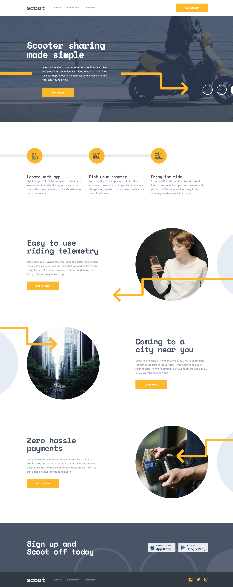

# Frontend Mentor - Scoot website solution

This is a solution to the [Scoot website challenge on Frontend Mentor](https://www.frontendmentor.io/challenges/scoot-multipage-website-N76alNPRJ). Frontend Mentor challenges help you improve your coding skills by building realistic projects.

## Table of contents

- [Overview](#overview)
  - [Screenshot](#screenshot)
  - [Built with](#built-with)
- [Author](#author)

## Overview

### Screenshot

### Built with

- HTML
- SASS
- JS
- VITE

## Author

- Frontend Mentor - [@Qheuss](https://www.frontendmentor.io/profile/Qheuss)
- LinkedIn - [Quentin Heusse](https://www.linkedin.com/in/quentin-heusse/)
